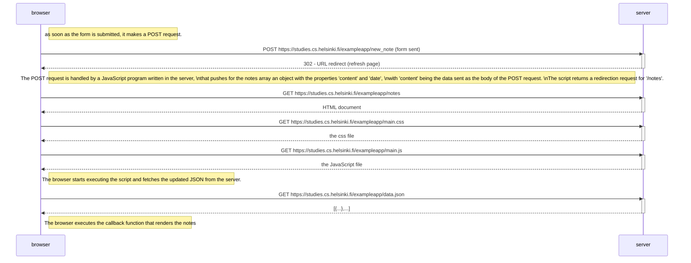

```mermaid
    sequenceDiagram
      participant browser
      participant server

      Note right of browser: as soon as the form is submitted, it makes a POST request.
      
    browser->>server: POST https://studies.cs.helsinki.fi/exampleapp/new_note (form sent)
      activate server
      server-->>browser: 302 - URL redirect (refresh page)
      deactivate server

      Note left of server: The POST request is handled by a JavaScript program written in the server, \nthat pushes for the notes array an object with the properties 'content' and 'date', \nwith 'content' being the data sent as the body of the POST request. \nThe script returns a redirection request for '/notes'.

      browser->>server: GET https://studies.cs.helsinki.fi/exampleapp/notes
      activate server
      server-->>browser: HTML document
      deactivate server

      browser->>server: GET https://studies.cs.helsinki.fi/exampleapp/main.css
      activate server
      server-->>browser: the css file
      deactivate server


      browser->>server: GET https://studies.cs.helsinki.fi/exampleapp/main.js
      activate server
      server-->>browser: the JavaScript file
      deactivate server

      Note right of browser: The browser starts executing the script and fetches the updated JSON from the server.

      browser->>server: GET https://studies.cs.helsinki.fi/exampleapp/data.json
      activate server
      server-->>browser: [{...},...]
      deactivate server

      Note right of browser: The browser executes the callback function that renders the notes
```
