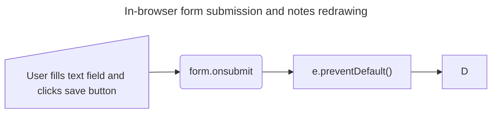

```mermaid
---
  title: In-browser form submission and notes redrawing
---
  flowchart LR
    A@{ shape: manual-input, label: "User fills text field and clicks save button"} --> B@{ shape: rounded, label: "form.onsubmit"} --> C@{ shape: rect, label: "e.preventDefault()"} --> D@{ shape: rect, label "captures data from form and stores it on var 'note'"}

```

```
```
