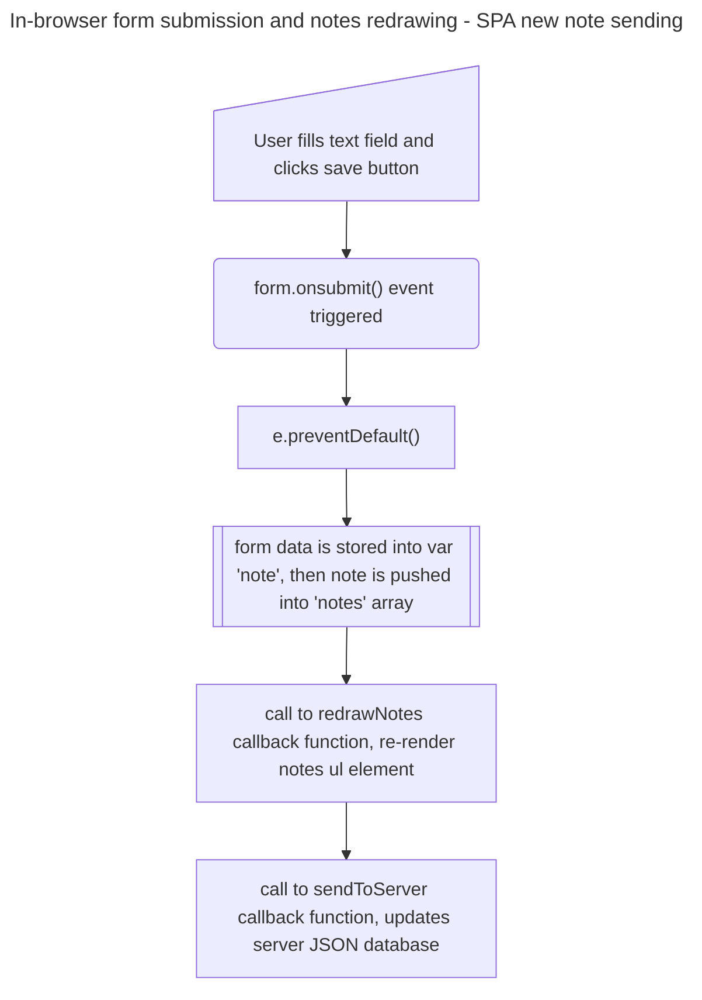

```mermaid
---
  title: In-browser form submission and notes redrawing - SPA new note sending
---
  flowchart TD
    A@{ shape: manual-input, label: "User fills text field and clicks save button"} --> B@{ shape: rounded, label: "form.onsubmit() event triggered"} --> C@{ shape: rect, label: "e.preventDefault()"} --> D@{ shape: fr-rect, label: "form data is stored into var 'note', then note is pushed into 'notes' array" } --> E@{ shape: rect, label: "call to redrawNotes callback function, re-render notes ul element"} --> F@{ shape: rect, label: "call to sendToServer callback function, updates server JSON database"}

```

```
```
